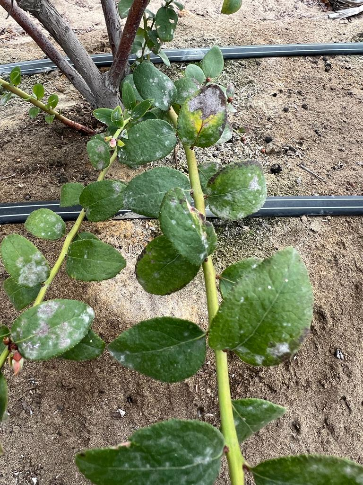
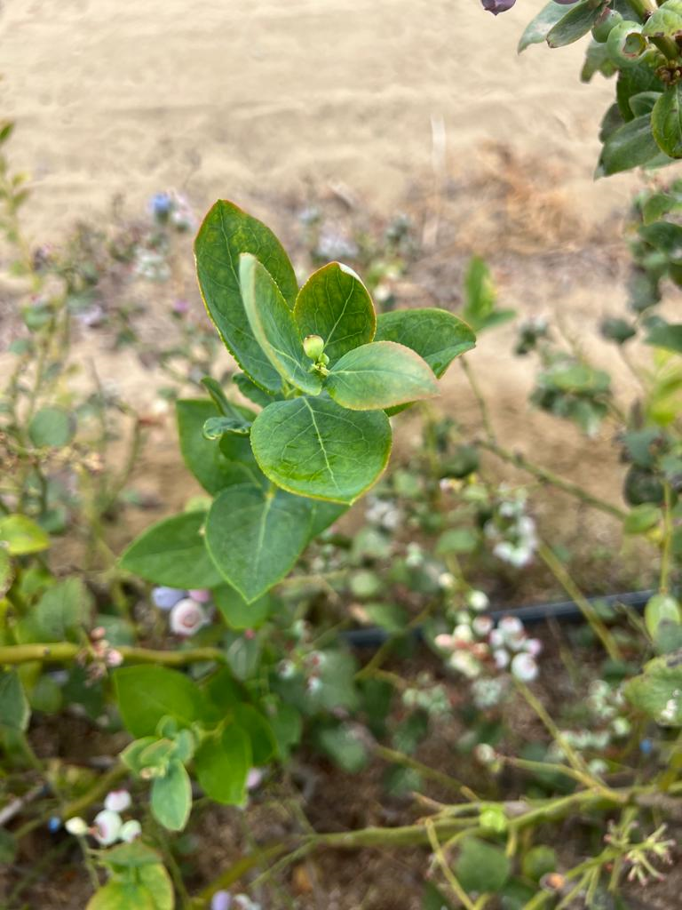
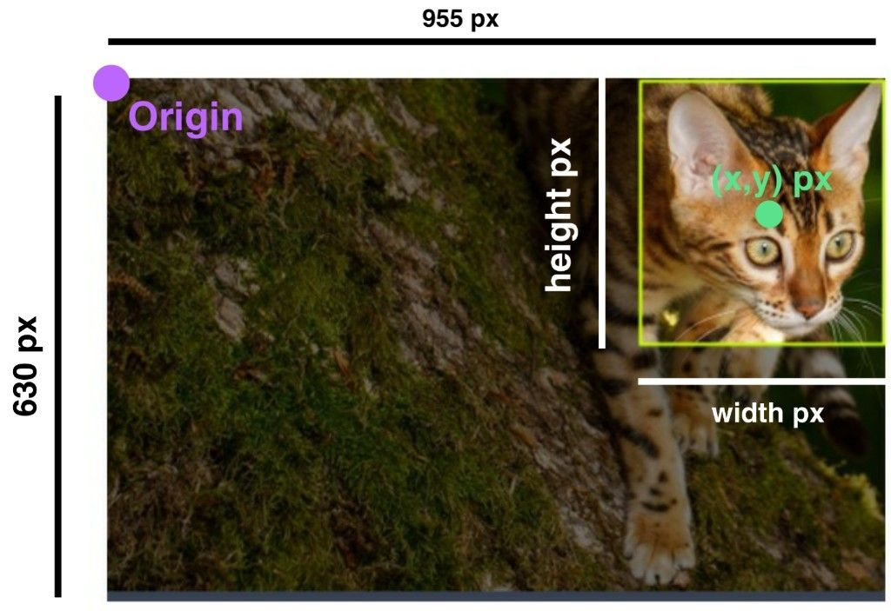
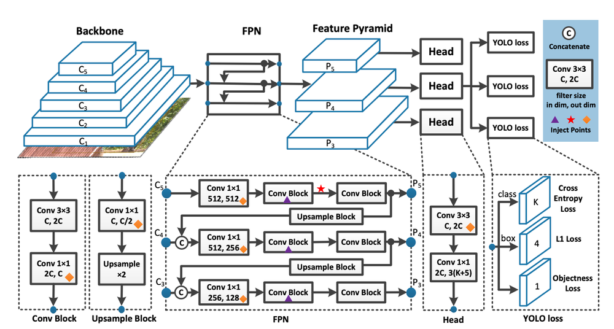

# Deteccion de Oidiosis en hojas de Arandano

## Descripcion del proyecto
El proyecto se basa en la deteccion de oidiosis en hojas de arandano, mediante el uso de redes neuronales convolucionales. El proyecto se divide en 3 partes:
- Generacion de dataset
- Entrenamiento de la red
- Deteccion de oidiosis en hojas de arandano

## Generacion de dataset
A grandes razgos un dataset es un conjunto de datos que se utilizan para entrenar un modelo de machine learning. Un dataset se compone de imagenes y etiquetas. Las imagenes son las que se utilizan para entrenar el modelo y las etiquetas son las que se utilizan para saber que clase de imagen es. 

### Imagenes
Las imagenes son como las siguientes:


Imagenes de hojas de arandano con oidiosis y sin oidiosis.
Las imagenes deben estar normalizadas, es decir, deben tener el mismo tamaño y deben estar en el mismo formato. En este caso las imagenes tienen el mismo tamaño y estan en formato jpg.

### Etiquetas
Las etiquetas ayudan a entrenar la red neuronal, ya que le dicen a la red neuronal que clase de imagen es y donde se encuentra la oidiosis en la imagen. Las etiquetas son como las siguientes:

```bash
0 0.5 0.5 0.5 0.5
```

La primera etiqueta es la clase de la imagen, en este caso 0 es sin oidiosis y 1 es con oidiosis. Las siguientes 4 etiquetas son las coordenadas de la oidiosis en la imagen. Los datos de la etiqueta son las siguientes:

```bash
class / x / y / width / height 
```



### Etiquetado de imagenes
Para etiquetar las imagenes se utilizo el etiquetador de Roboflow, el cual es una herramienta que permite etiquetar imagenes de manera rapida y sencilla. El etiquetador de Roboflow es como el siguiente:


## Entrenamiento de la red
Para entrenar el modelo de IA se hizo uso de una tecnica muy popular y bastente buena llamada transfer learning. Transfer learning es una tecnica que consiste en utilizar un modelo de IA ya entrenado y modificarlo para que se adapte a las necesidades del proyecto. En este caso se utilizo el modelo de IA llamado YOLOv7, el cual es un modelo de IA que se utiliza para la deteccion de objetos en imagenes.

### YOLOv7
YOLOv7 es un modelo de IA que se utiliza para la deteccion de objetos en imagenes. YOLOv7 es un modelo de IA que se basa en redes neuronales convolucionales. Las redes neuronales convolucionales son un tipo de red neuronal que se utiliza para la clasificacion de imagenes. La arquitectura de YOLOv7 es la siguiente:



Pagina de YOLOv7: https://github.com/WongKinYiu/yolov7

### Entrenamiento
Para entrenar el modelo se usa el siguiente comando:

```bash
python .\yolov7\train.py --workers 1 --device 0 --batch-size 4 --data data.yml --img 640 640 --cfg .\yolov7\cfg\training\yolov7.yaml --weights 'yolov7.pt' --name avocado --hyp .\yolov7\data\hyp.scratch.p5.yaml --epochs 4
```

Los workers son los nucleos de la computadora que se van a utilizar para entrenar el modelo. El device es el numero de la tarjeta grafica que se va a utilizar para entrenar el modelo. El batch-size es el numero de imagenes que se van a utilizar para entrenar el modelo. El data es el archivo de configuracion de los datos. El img es el tamaño de las imagenes que se van a utilizar para entrenar el modelo. El cfg es el archivo de configuracion del modelo. El weights es el modelo que se va a utilizar para entrenar el modelo. El name es el nombre del modelo. El hyp es el archivo de configuracion de los hiperparametros. El epochs es el numero de veces que se va a entrenar el modelo.

## Deteccion de oidiosis en hojas de arandano
Para la deteccion de oidiosis en hojas de arandano se utilizo el modelo de IA entrenado en la parte anterior. Para la deteccion de oidiosis en hojas de arandano se utiliza el siguiente script:

```bash
import torch
import cv2
import numpy as np

model = torch.hub.load()

model.conf = 0.4

cam = cv2.VideoCapture(0) 

while(True): 
    ret, frame = cam.read()
    frame = cv2.flip(frame, 1)
    result = model(frame,size=640)
    cv2.imshow('Palta', np.squeeze(result.render()))
    if cv2.waitKey(1) & 0xFF == ord('q'):
        break

cam.release()
# close all windows
cv2.destroyAllWindows()
```

A grandes rasgos el script es un script que abre la camara de la computadora y por cada ciclo del while se obtiene una imagen de la camara, se le aplica el modelo de IA y se muestra el resultado en una ventana.